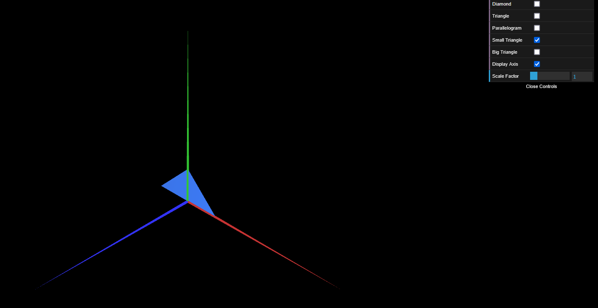
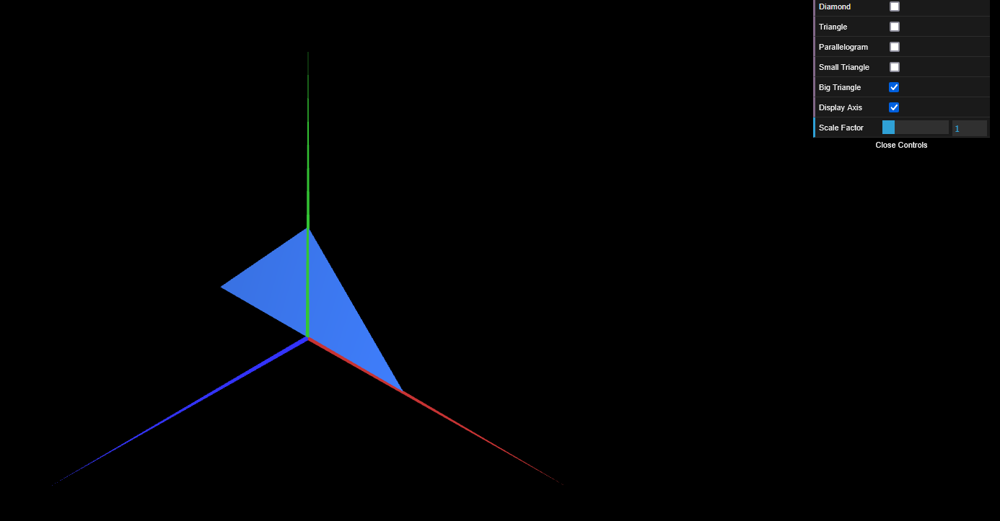

# CG 2024/2025

## Group T05G05

## TP 1 Notes

- In exercise 1 while doing the parallelogram we observed that we need to put the indices in the reverse order to make it double-sided.

### Screenshot of Exercice 2 Triangle Small (Figure 5):

### Screenshot of Exercice 3 Triangle Big (Figure 6):

