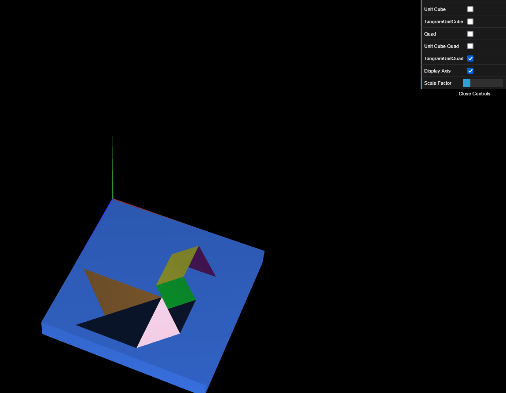

# CG 2024/2025

## Group T05G05

## TP 2 Notes

- In exercise 2.3 we observed that the lighting is "messed up" and that it has to do with normal vectors, but we assume we are going to learn how to fix it in TP3 - Lighting and Materials.

- In exercise 3.4 and 3.5 we noticed that when we made both figures go in the same coordinates, they would "collide" with each other and the graphics became "messed up". So we separated them by making it so that the Tangram also translates 0.1 up.

- In exercise 4.3 we noticed that we still needed to offset the Tangram by 0.1 so it doesn't collide with the base and we also noticed that it was significantly faster applying the transformations to the square than creating the cube from scratch with all the vertices coordinates and indices.

### Screenshot of Exercice 2.3 Tangram:

### Screenshot of Exercice 3.5 Tangram with Unit Cube as base:

### Screenshot of Exercice 4.3 Tangram with Unit Cube Quad as base:

