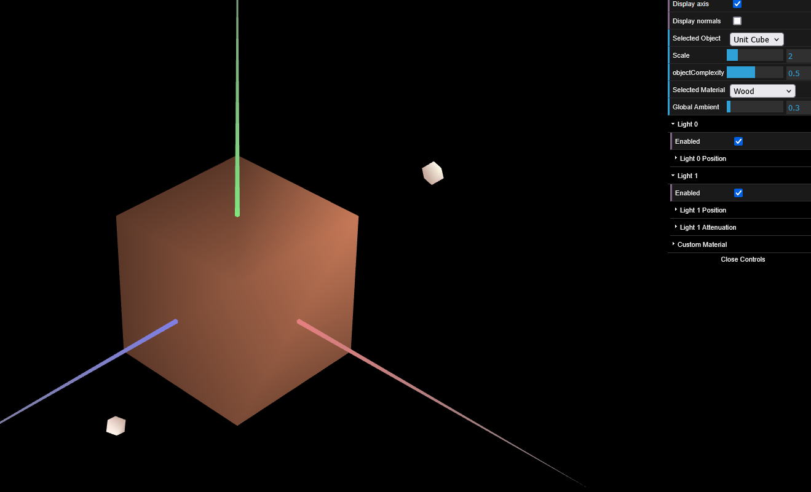
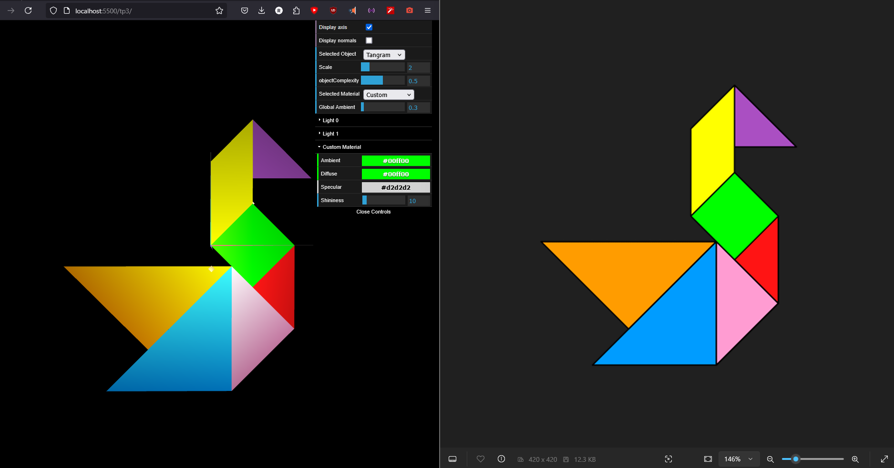

# CG 2024/2025

## Group T05G05

## TP 3 Notes

- In exercise 6 of Part 1 we observed that we were previously doing things the "wrong way" when we had previously put colors on the tangram. We were using this.scene.setDiffuse() function, instead of creating specific materials.  

### Screenshot tp3-1 (Part 1 - Exercice 4):

### Screenshot tp3-2 (Part 1 - Exercise 6):

