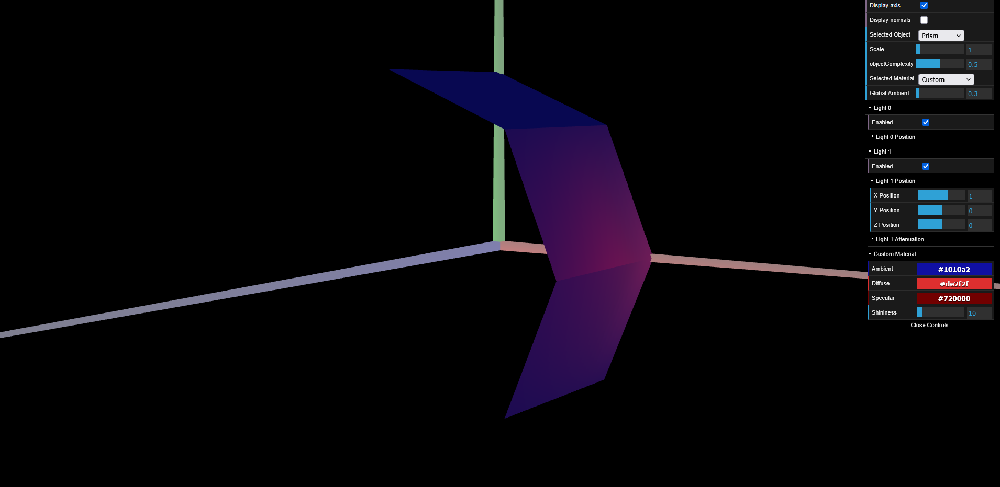
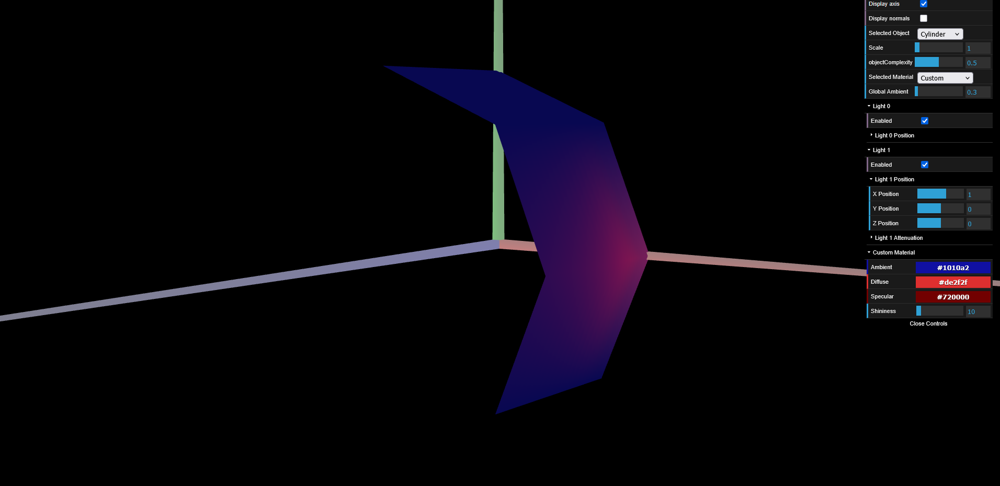

# CG 2024/2025

## Group T05G05

## TP 3 Notes

- In exercise 6 of Part 1 we observed that we were previously doing things the "wrong way" when we had previously put colors on the tangram. We were using this.scene.setDiffuse() function, instead of creating specific materials.  

- In exercise 9 of Part 2, we weren't sure if the column should have it's base on the XY axis or the XZ axis. Because in the instructions it says that the column should be vertical, but it also says that it should still have the length of 1 in the Z axis. So we assumed that vertical means with the base in the XY axis.

- In exercise 13 of Part 3, we indeed notice that the transition of the lightning between the edges are smoother.

### Screenshot tp3-1 (Part 1 - Exercice 4):

### Screenshot tp3-2 (Part 1 - Exercise 6):

### Screenshot tp3-3 (Part 2 - Exercise 9):

### Screenshot tp3-4 (Part 2 - Exercise 12):

