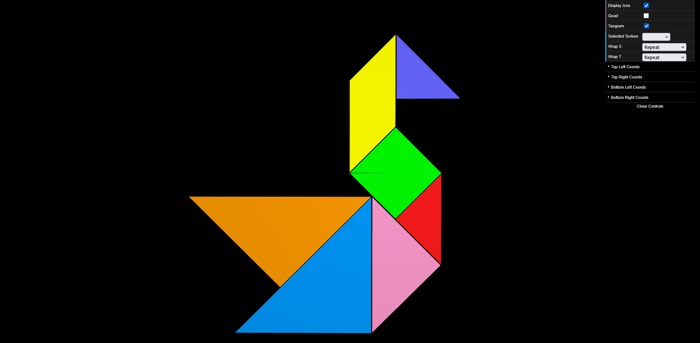

# CG 2024/2025

## Group T05G05

## TP 4 Notes

- In exercise 3, we made it so that the coordinates of the vertices in the texture correspond to the coordinates of the vertex of the object, to prevent the black lines from appearing in the middle of the object.

### Screenshot tp4-1 (Exercice 3):

